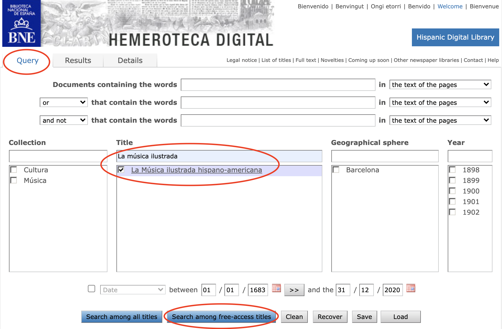

# Polifonia OCR

This repository contains the code for downloading and digitising documents used as a corpus for the [Polifonia Project](https://polifonia-project.eu/).
The repository contains two main types of code:
* file scrapers that automate the download of big repositories of textual data;
* OCR script for digitising the downloaded files. 

Since these two types of scripts can also be used as stand-alone software, they are documented separately, while the setup and the requirement installation is documented for all the scripts contained in the repository.

## Requirements and Installation
For running all the scripts you need to have Python (3.6+, version 3.9 suggested) and pip3 installed on your machine.
Instructions for installing Python and pip can be found on the [Python download page](https://www.python.org/downloads/).

Once Python is installed, it is necessary to clone the repository using git (installation information on [this page](https://git-scm.com/book/en/v2/Getting-Started-Installing-Git)):

```
git clone https://github.com/polifonia-project/OCR.git
```

The libraries needed to execute all scripts can be installed running:
```
pip install requirements.txt
```

For running the OCR Script it is required to install [Tesseract](https://github.com/tesseract-ocr/tesseract) and the trained data for the languages you need to work with.
The full documentation for installing Tesseract and its dependencies can be found in [Tesseract official documentation](https://tesseract-ocr.github.io/tessdoc/Installation.html).

## Usage
### Internet Culturale scraper
For downloading resources from "Internet Culturale" you need to run the ```internet_culturale_scraper.py``` as:
```
python3 src/internet_culturale_scraper.py [-h] [--resource_url] [--output_path]
```

The parameter to pass are described as follows:
```
--resource_url (string):  the url of a resource page on "Internet Culturale" (e.g. "https://www.internetculturale.it/it/913/emeroteca-digitale-italiana/periodic/testata/8670"

--output_path (string):  the existing path in with to save the downloaded resource
```

You can also browse the script's documentation by typing:
```
python3 src/internet_culturale_scraper.py --help
```

The script will download all files related to the given resource to the specified folder. 
Depending on the size of the resource and the speed of the connection, the download may take several hours.

In addition, a log file named ```download_log.txt``` will be generated in the output folder. This file will list:
* the number of files downloaded; 
* the number of errors encountered;
* the list of files not downloaded.

To attempt to download the non-downloaded files again, simply restart the script with the same parameters. 

### Hemeroteca Digital scraper

For downloading resources from "Internet Culturale" you need to run the ```internet_culturale_scraper.py``` as:
```
python3 src/hemeroteca_digital_scraper.py [-h] [--resource_url] [--output_path]
```

The parameter to pass are described as follows:
```
--resource_url (string):  the url of a resource page on "Hemeroteca Digital" (e.g. "http://hemerotecadigital.bne.es/results.vm?q=parent%3A0003894964&s=0&lang=es"

--output_path (string):  the existing path in with to save the downloaded resource
```

You can also browse the script's documentation by typing:
```
python3 src/hemeroteca_digital_scraper.py --help
```

The resource url must be the url of a specific resource search result of the "Query" section, only searching for resource's "Title", and clicking on "Search among free-access titles", as illustrated in the image:

Remember to select **only** one resource at the time. 

### OCR Script

```
ocr_pdf.py [-h] [--input_path] [--output_path] [--output_format] [--output_name] [--language_mode]
                  [--single_language] [--multiple_langs] [--gray_scale] [--remove_noise]
                  [--thresholding] [--dilate] [--erosion] [--edge_detection] [--skew_correction]
                  [--page_segmentation_mode] [--ocr_engine_mode]

```

```
optional arguments:
  --input_path 
  --output_path 
  --output_format 
  --output_name 
  --language_mode 
  --single_language 
  --multiple_langs 
  --gray_scale 
  --remove_noise 
  --thresholding 
  --dilate 
  --erosion 
  --edge_detection 
  --skew_correction 
  --page_segmentation_mode 
  --ocr_engine_mode 

```
